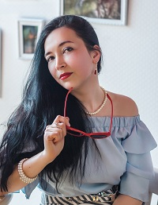

# Albina Rakhimova


### Phone:
+99890 917 45 19 (Telegram, WhatsApp)
### E-mail:
sirenita.violetta@gmail.com

### About me
For a couple of years, I felt myself at the wrong place doing something I do not really like. 
I believe I can do much more than I do now. After long researches and analysis, I realized that I wish to develop applications. 
Perhaps, web-based. So, my goal is to get the necessary skills to start as soon as possible.

### Skills 
Basics of HTML, CSS, basics of JavaScript, Trello, slightly touched Bootstrap, GitHub. A little experience in creating web pages.

### Education: 
Moscow University of Technologies, Faculty of Software Development (bachelor diploma in 2022). 
In the meantime, I am finalizing CS50 at Harvard College and ready to work hard on Javascript/Frontend в RS School.

### English: 
Get B2+ certificate from learning center in 2008, later received the certificate for С1 from UNESCO. Had speaking practicing during 5 years (2005-2010)

Reading – C1

Writing – C1

Listening – B2+ watching movies w/o subtitles, listening poems and short stories.

Speaking – B2+ practicing with foreigners once a week.


### Coding Example:
```
<!DOCTYPE html>
<html lang="en">
<head>
<meta charset="utf-8">
<meta name="viewport" content="width=device-width">
<title>Albina Rakhimova</title>
<link href="cvstyle.css" rel="stylesheet">
</head>
<body>
<header>
<h1>Albina Rakhimova<h1>
<nav>
<div class="contacts">
<ul>
<li>+99890 917 45 19 (Telegram, WhatsApp)</li><br><br>
<li>sirenita.violetta@gmail.com</li>
</ul>
</header>

<footer><h3>https://github.com/SirenitaV 
<br><br>
2021 </h3>
<br><br>
<a href="https://rs.school/js/">RS School</a>
</footer>
</body>
</html>
```
